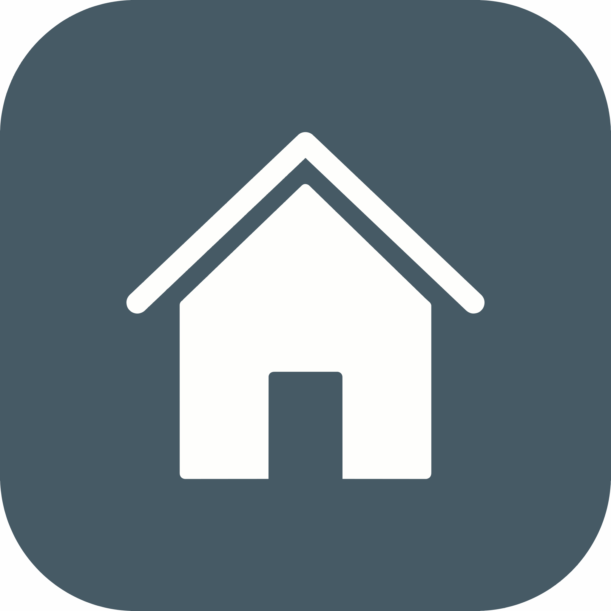

<p align="center">
  <a href="" rel="noopener">
 </a>
</p>

<h3 align="center">Rentify</h3>

<div align="center">

[]()
[](https://github.com/Rahul8320/Rentify/issues)
[](https://github.com/Rahul8320/Rentify/pulls)
[](/LICENSE)

</div>

---

<p align="center"> Searching property made easy.
    <br> 
</p>

## 📝 Table of Contents

- [About](#about)
- [Features](#features)
- [Technologies](#technologies)
- [Getting Started](#getting_started)
- [Running the tests](#tests)
- [Usage](#usage)
- [Deployment](#deployment)
- [Built Using](#built_using)
- [Authors](#authors)
- [Acknowledgments](#acknowledgement)

## 🧐 About <a name = "about"></a>

This project provides a robust and scalable platform for property search, enabling buyers to find their dream homes and sellers to effortlessly list their properties.

## ⚙️ Features <a name="features"></a>

- **Property Search:**
  - Buyers can search for properties based on various criteria, including:
    - Number of bedrooms
    - Location (including search by radius or specific addresses)
    - Nearby places (e.g., schools, parks, restaurants)
  - Enhanced search experience with user-friendly filtering and sorting options.
- **Property Listing:**
  - Sellers can register and log in to the system.
  - Sellers can add new properties with detailed descriptions, photos, and relevant information.
- **Authentication and Authorization:**
  - Secure user authentication using ASP.NET Core Identity Server.
  - Role-based access control (RBAC) to restrict unauthorized actions.

## 👩‍💻 Technologies <a name="technologies"></a>

**Backend:**

- ASP.NET Core: A robust and flexible framework for building web APIs.
- Identity Server: Secure user authentication and management.
- CQRS Pattern: Efficient handling of read and write operations for improved scalability.
- Serilog: Comprehensive and structured logging for better application monitoring.
- In-Memory Caching: Caching frequently accessed data for faster performance.

**Frontend:**

- React: A popular JavaScript library for building dynamic and user-friendly interfaces.
- TypeScript: Typed JavaScript extension for enhanced code maintainability and catch errors early.
- Redux (or Context API): State management solution for managing application state in the frontend (replace with your chosen library).
- React Hook Form: Efficient form handling and validation.

## 🏁 Getting Started <a name = "getting_started"></a>

These instructions will get you a copy of the project up and running on your local machine for development and testing purposes. See [deployment](#deployment) for notes on how to deploy the project on a live system.

### Prerequisites

- .NET Core SDK (https://dotnet.microsoft.com/en-us/download)
- .NET CLI & EF Core Tools (https://learn.microsoft.com/en-us/ef/core/cli/dotnet)
- Node.js and npm (https://nodejs.org/en/about/previous-releases)

### Installing

**Backend:**

- Clone the repository.
- Navigate to the backend directory.
- Restore NuGet packages:

```
dotnet restore
```

- Run migrations to create database schema:

```
dotnet ef migrations
```

- Apply migrations:

```
dotnet ef database update
```

- Start the backend API:

```
dotnet run --project .\Rentity.Api\
```

**Frontend:**

- Navigate to the frontend directory.
- Install dependencies:

```
npm install
```

- Start the development server:

```
npm run dev
```

## 🔧 Running the tests <a name = "tests"></a>

Explain how to run the automated tests for this system.

### Break down into end to end tests

Explain what these tests test and why

```
Give an example
```

### And coding style tests

Explain what these tests test and why

```
Give an example
```

## 🎈 Usage <a name="usage"></a>

- This README provides a high-level overview. Refer to the project's code and documentation for detailed implementation details.
- Implement unit and integration tests for robust code quality.
- Explore containerization with Docker for easier deployment and scalability.

## 🚀 Deployment <a name = "deployment"></a>

Add additional notes about how to deploy this on a live system.

## ⛏️ Built Using <a name = "built_using"></a>

- [Sqlite](https://www.sqlite.org/index.html) - Database
- [ASP.NET Core](https://dotnet.microsoft.com/en-us/apps/aspnet) - Backend Framework
- [Serilog](https://serilog.net/) - Structured Logging
- [ReactJs](https://react.dev/) - Web Framework
- [React Hook Form](https://react-hook-form.com/) - Forms Validation
- [Shadcn](https://ui.shadcn.com/) - Component Library
- [Tailwindcss](https://tailwindcss.com/) - CSS Library

## ✍️ Authors <a name = "authors"></a>

- [@Rahul8320](https://github.com/Rahul8320) - Idea & Initial work

See also the list of [contributors](https://github.com/kylelobo/The-Documentation-Compendium/contributors) who participated in this project.

## 🎉 Acknowledgements <a name = "acknowledgement"></a>

- Hat tip to anyone whose code was used
- Inspiration
- References
